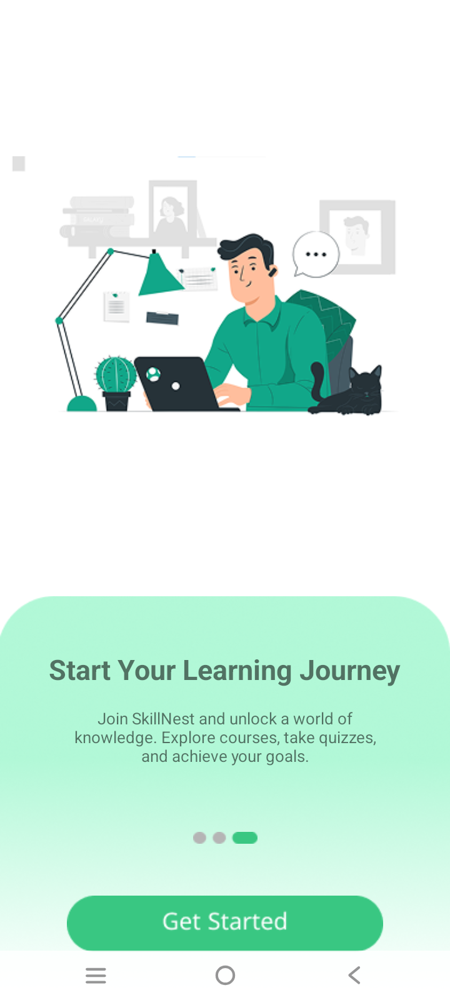
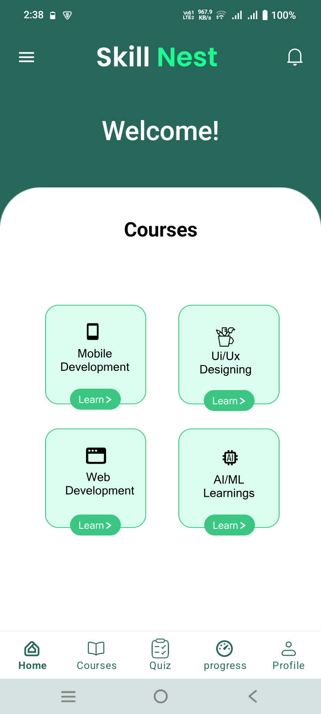
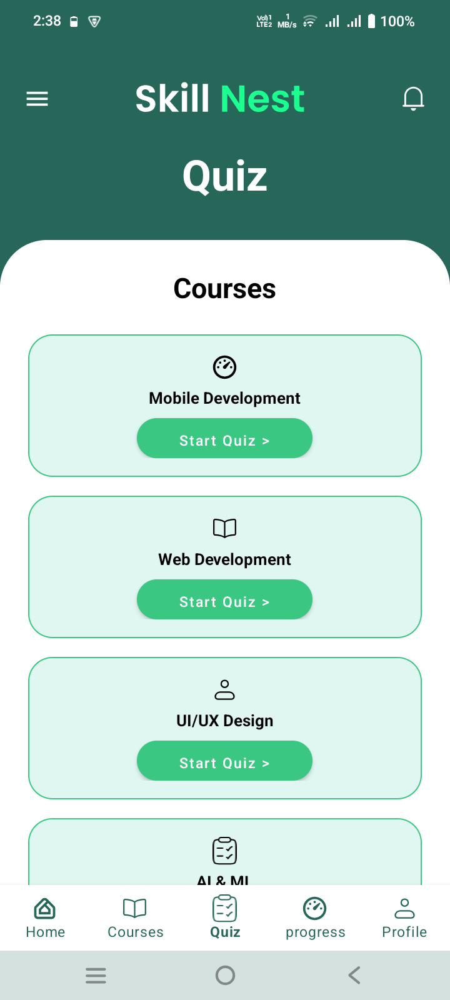
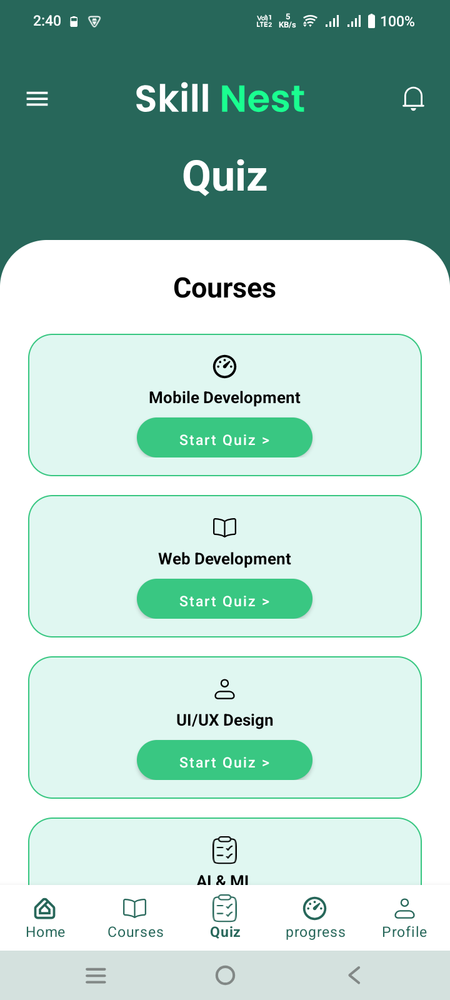
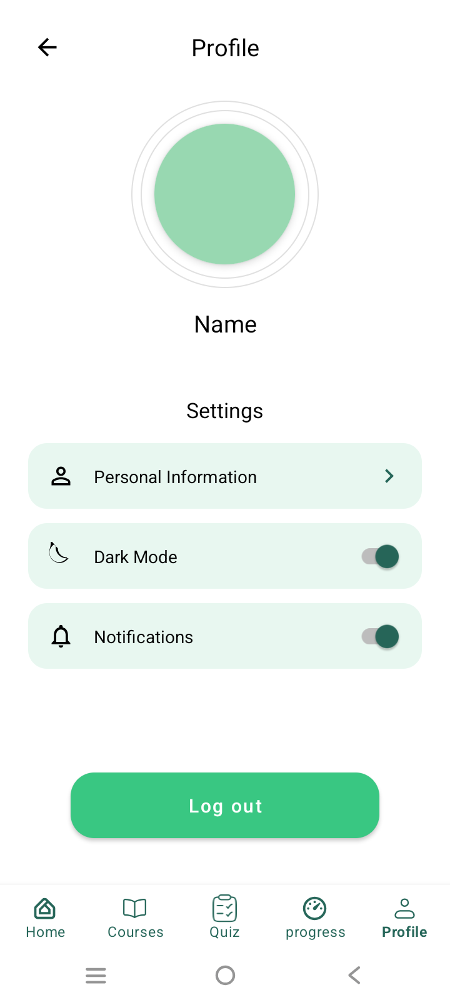

# Skill Nest 🎓

**Skill Nest** is a modern, interactive mobile learning platform designed to help users acquire new skills at their own pace. The application provides a seamless learning experience through high-quality course content, interactive quizzes, and personalized progress tracking.

---

## 🚀 Features

### 🌟 Onboarding Experience
A multi-screen onboarding flow to introduce users to the platform:
- **Learn Anytime, Anywhere**: Focus on accessibility and mobile learning.
- **Track Your Progress**: Motivation through visual achievements and quiz scores.
- **Start Your Learning Journey**: Call to action to join the community.

### 📚 Learning & Courses
- **Course Categories**: Organized by domains (e.g., Mobile Development).
- **Interactive Content**: Engaging UI to differentiate subjects and lessons.

### 📝 Interactive Quiz System
- **Real-time Feedback**: Test knowledge through multiple-choice questions (MCQs).
- **Question Navigation**: Intuitive Next/Finish controls.
- **Score Calculation**: Instant results tracking (e.g., 8/10).

### 📊 Progress Tracking
- **Visual Stats**: Monitor completed lessons and average quiz scores in one place.
- **Achievement Metrics**: Progress percentages to keep learners motivated.

### 👤 User Profile & Settings
- **Personal Information**: Manage identity and avatar.
- **App Customization**: 
  - **Dark Mode**: Toggle for low-light environments.
  - **Notifications**: Management of learning reminders.
- **Secure Logout**: Safely exit the application.

---

## 📸 Screenshots

<table>
  <tr>
    <td></td>
    <td></td>
    <td></td>
  </tr>
  <tr>
    <td align="center">Onboarding</td>
    <td align="center">Home Screen</td>
    <td align="center">Quiz System</td>
  </tr>
  <tr>
    <td></td>
    <td></td>
  </tr>
  <tr>
    <td align="center">Progress</td>
    <td align="center">Profile</td>
  </tr>
</table>

---

## 🛠 Technical Architecture

### Tech Stack
- **Platform**: Android
- **Languages**: Java & Kotlin
- **Database**: Firebase Realtime Database
- **UI Framework**: Material Components & ConstraintLayout

### Key Dependencies
```gradle
dependencies {
    implementation "androidx.core:core-splashscreen:1.0.1"
    implementation "com.google.firebase:firebase-database:22.0.1"
    implementation "com.google.android.material:material:1.14.0"
    implementation "androidx.constraintlayout:constraintlayout:2.2.0"
}
```

---

## 🎨 UI/UX Design
The app follows a clean, **Brand Green** aesthetic:
- **Primary Color**: `#39C782` (Brand Green)
- **Secondary Color**: `#27675A` (Dark Green)
- **Backgrounds**: `#E8F7F0` (Light Mint)
- **Typography**: Clean sans-serif fonts optimized for readability.

---

## 📱 Navigation
The application uses a standard 5-tab `BottomNavigationView`:
1. **Home**: Dashboard and featured courses.
2. **Courses**: Full library of learning materials.
3. **Quiz**: Knowledge assessments.
4. **Progress**: Learning statistics.
5. **Profile**: User settings and account management.

---

## ⚙️ Setup & Installation
1. Clone the repository.
2. Open the project in **Android Studio**.
3. Connect your **Firebase** project and add the `google-services.json` file to the `app/` directory.
4. Sync Gradle and run the app on an emulator or physical device.

---

*Skill Nest - Empowering your learning journey.*
